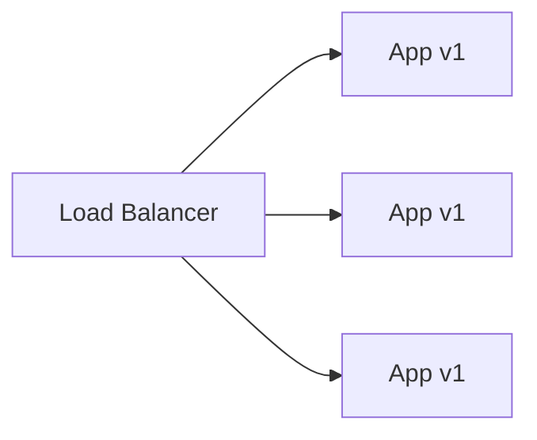
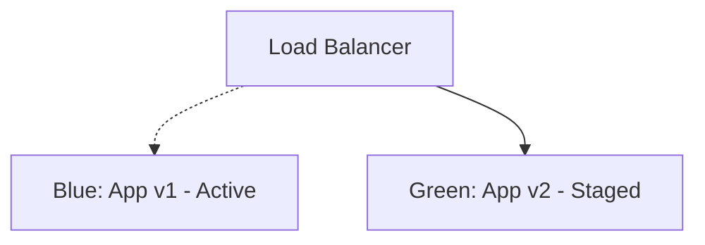
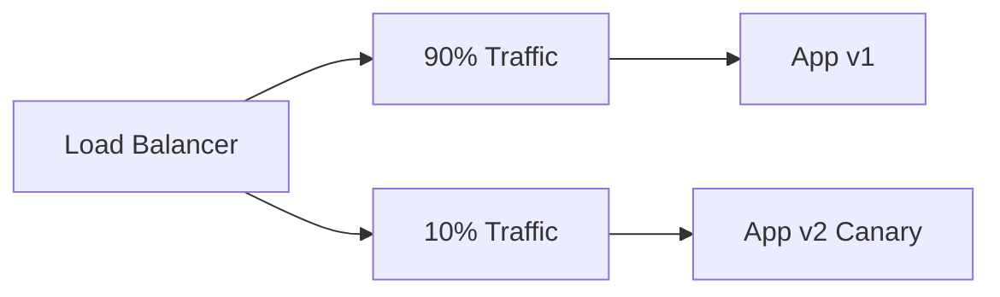

# Deployment Strategies Deep-Dive

## 1. Rolling Deployment

Gradually replaces instances. V1_A is taken down, updated to V2, and brought back. Then V1_B, etc.
- **Pros**: Easy to set up, no extra infrastructure cost.
- **Cons**: Deployment takes time, version mismatch during deploy (users might hit v1 then v2).

## 2. Blue-Green Deployment

Stand up exact replica (Green) alongside active (Blue). Once Green is verified, flip the router to send 100% traffic to Green.
- **Pros**: Instant rollback (flip router back), zero downtime, safe testing in prod.
- **Cons**: Expensive (double infrastructure).

## 3. Canary Release

Deploy new version to a subset of infrastructure. Route a small percentage of real traffic to it. Validate metrics, then slowly scale to 100%.
- **Pros**: Minimizes blast radius of bugs. Perfect for performance testing.
- **Cons**: Complex routing logic required, slow full release.
